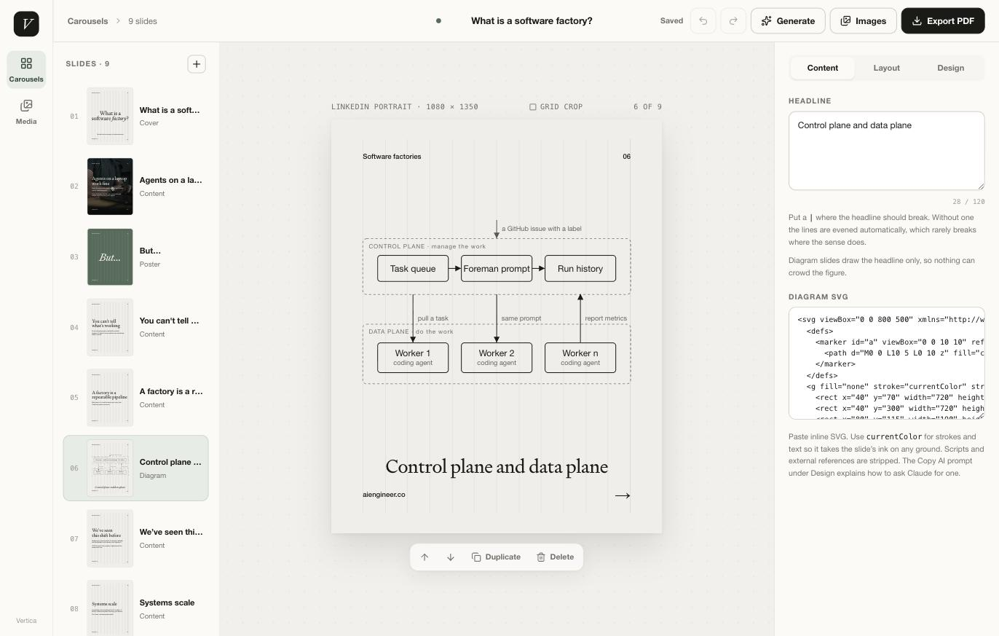

# Vertica

A studio for LinkedIn and Instagram carousels. One editorial design system, seven
slide layouts, a media library, and one-click export to PDF or numbered JPEGs.

Every deck is a small JSON document. You can write it by hand, paste it from Claude,
or generate it from plain text, and the app renders it the same way in the editor,
in the gallery, and in the export.



## Run it

Requires Node.js 22.13 or newer.

```bash
npm install
npm run dev
```

That starts the API on port 8787 and Vite on the port it prints, with `/api`
proxied through. Decks and images are written to `.data/` in the project, so
nothing leaves your machine.

`npm test` typechecks, builds, and runs the tests. `npm run lint` runs ESLint.

## Experimental video backgrounds

Install `ffmpeg` and `ffprobe` on the server's PATH (`brew install ffmpeg` on
macOS). The Docker image includes them. In the editor, open **Design → Choose a
video**, upload an MP4 or MOV, and set the clip's start and duration. Use the
existing text, positioning, colours, and background veil. Pause/play controls are
available in the editor and reader preview.

**Export → Video slide** downloads the selected slide as a silent 1080 × 1350,
30 fps H.264 MP4. It keeps the preview's centred 4:5 crop and burns in the text,
branding, and veil. PDF and JPEG exports use the selected clip's first frame.
MP4 export currently produces one slide at a time; there is no audio, animated
text, timeline, or combined deck video.

Sources can be 1–120 seconds, up to 512 MB and 4096 pixels on either side. Clips
can be 1–30 seconds. The editor reads and stores the source duration and constrains
the start and duration to fit; older saved intervals are corrected when the video
metadata loads. Uploads use 8 MB chunks in the
same storage bucket as the app, so they work across server instances. The server
creates a smaller, silent H.264 copy for playback and deletes the uploaded source
chunks after processing. Interrupted uploads expire after an hour and are cleaned
up on the next upload. Existing videos can be reused from the video picker.

Video processing uses temporary disk and one encoder per instance, with a
three-minute processing timeout. The deploy script allocates 2 GiB of memory,
two CPUs, four concurrent requests, and a five-minute request timeout because
Cloud Run also charges temporary files against memory. A busy encoder returns a
retryable error. This branch changes deployment settings but does not deploy them.

Run `npm test` with FFmpeg installed to include actual video upload, encoding,
crop, overlay, duration, and error-path checks. Those integration checks report
as skipped when FFmpeg is absent; parser and API validation checks still run.

## How it is built

One Node process, one bucket, one container.

```
app/            the React app (Vite)
  carousel.ts     the document model, parser, generator, AI prompt
  slide.tsx       the one renderer, used for the editor, the gallery and the export
  editor.tsx      the editor screen
  dashboard.tsx   the gallery
  media-*.tsx     the media library and the picker
  export.ts       PDF and ZIP export, rasterised from the DOM at 2x
  image-store.ts  content-addressed media keys, IndexedDB cache in front of the API
  save-queue.ts   ordered, coalesced autosave
  globals.css     the design system and the app chrome
server/         the API and static host (Hono)
  bucket.ts       the storage interface: Google Cloud Storage, or a folder on disk
  store.ts        decks and media as objects
  api.ts          routes and validation
  auth.ts         the optional shared-password gate
tests/          node:test suites, run against the on-disk bucket
```

Three ideas do most of the work.

**One renderer.** `Slide` draws a slide from its JSON. The editor preview, the rail
thumbnails, the gallery cards and the export stage are all that component at
different sizes. Type is set in container-width units, so a 64px thumbnail and a
1080px export are the same drawing.

**Objects, not tables.** There is no database. A deck is `carousels/<id>.json` in the
bucket with its gallery summary in the object's metadata, so listing the gallery
never downloads a document. Its version is the object's generation, and every save
carries the generation the client last read. The bucket refuses a stale write, the
API turns that into a 409, and the editor asks you to reload. Two tabs on one deck
cannot clobber each other.

**Keys, not bytes.** Images live under a content hash at `media/<hash>`. A deck
stores `img:` keys, the browser caches bytes in IndexedDB, and the API serves them
on any machine. Deleting a library image is refused while a deck still uses it.

## The design system

Signifier for headlines, Helvetica for copy and furniture, paper ground with sage
and black as the two alternative grounds. A faint twelve-column field sits under
every text slide. Series label top left, a two-digit page number top right, footer
bottom left, a swipe arrow bottom right on every slide but the last.

Seven layouts, each with one job. Note, poster, diagram and photos draw the headline
only, so nothing can collide with the figure.

| Layout | Draws | Use it for |
|---|---|---|
| `cover` | headline, one-line subtitle | the opener |
| `content` | headline, copy | most slides |
| `note` | one sans statement, `**bold**` for emphasis | an aside |
| `poster` | one short serif statement | the strongest line |
| `diagram` | inline SVG, headline as caption | architecture and flows |
| `photos` | one to nine pictures under a title | a figure, a filmstrip, a grid |
| `closing` | headline, one line | the finish |

Inline marks: `*word*` for italic, `**phrase**` for a highlighter stroke, `|` in a
headline to force the line break. Photos can also sit behind the copy on any slide,
with a per-slide veil dial.

`.claude/skills/carousel/SKILL.md` is the house style for writing a deck: the
seven-slide arc, the one character slide, copy rules, diagram rules, and the JSON
shape. In Claude Code, `/carousel` loads it.

## The document

```json
{
  "version": 1,
  "title": "What is a software factory?",
  "author": "aiengineer.co",
  "mark": "Software factories",
  "slides": [
    { "layout": "cover", "title": "What is a | software *factory*?", "body": "A thesis, and the place it breaks" },
    { "layout": "content", "title": "Agents are | inconsistent", "body": "Fifty runs, fifty answers.\n\nPrompts narrow the spread. They do not close it." },
    { "layout": "poster", "tone": "sage", "title": "*Except…*" },
    { "layout": "diagram", "title": "Control plane and data plane", "diagram": "<svg viewBox=\"0 0 800 500\">…</svg>" },
    { "layout": "closing", "title": "Build the tool. | Keep the agent for *judgment*.", "body": "Link in the comments." }
  ]
}
```

Optional fields: `arrow: false`, and per slide `tone`, `position`, `align`,
`background`, `video`, `veil`, `images`. Page numbers always use `01`, `02`, etc.
`parseCarouselConfig` in `app/carousel.ts` is the contract; it
throws a plain message for anything the app would refuse, and it maps older layout
names onto the current seven.

Diagrams are sanitised on the way in. Scripts, event handlers, embedded HTML,
stylesheets, and external references are stripped. Use SVG presentation attributes
or inline styles for drawing properties such as fill, stroke, and font size;
page layout rules and resource-loading CSS are removed.

## Deploying

The service runs on Cloud Run with one Cloud Storage bucket. `npm run deploy` builds
from source and deploys; set `PROJECT`, `REGION`, `SERVICE` and `BUCKET` to override
the defaults at the top of `deploy.sh`.

One-time setup for a fresh project, with an authenticated `gcloud`:

```bash
gcloud services enable run.googleapis.com cloudbuild.googleapis.com artifactregistry.googleapis.com secretmanager.googleapis.com
gcloud storage buckets create gs://$BUCKET --location $REGION --uniform-bucket-level-access --public-access-prevention
printf '%s' "$PASSWORD" | gcloud secrets create vertica-app-secret --data-file=-
```

Then give the Cloud Run service account `roles/storage.objectAdmin` on the bucket,
`roles/secretmanager.secretAccessor` on the secret, and the build roles
(`cloudbuild.builds.builder`, `artifactregistry.writer`, `logging.logWriter`,
`storage.objectViewer`) on the project. The deploy disables Cloud Run's invoker IAM
check, because an organisation with domain-restricted sharing cannot grant
`allUsers` the invoker role and the URL would answer 403 to everyone. The app's own
password gate is what protects it.

The container requires two variables in production: `BUCKET`, the bucket name, and
`APP_SECRET`, the shared password. It refuses to start if either is missing, so a
misconfigured Cloud Run revision cannot silently write to ephemeral disk or expose an
open API. With `APP_SECRET` set the whole app sits behind one password,
exchanged for an HMAC-signed cookie so the secret itself never reaches the browser.
With it unset the app is open, which is what local development wants. With `BUCKET`
unset the server uses `.data/` on disk.

## Fonts

Signifier is a commercial face from Klim and is not bundled. The app loads it from
the machine and warns in the editor when it is missing, since the export would
otherwise ship Georgia. Helvetica is a system font on macOS; elsewhere Arial stands
in.

## Licence

MIT.
