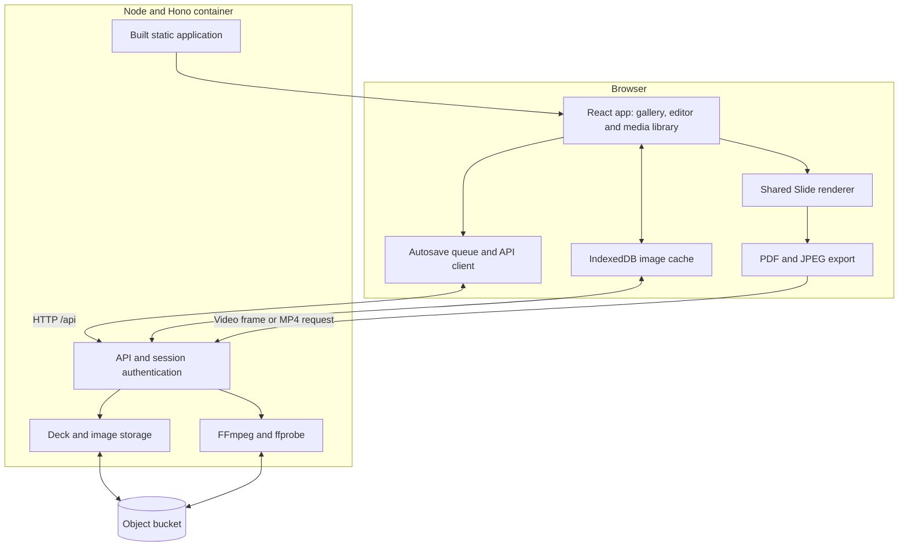
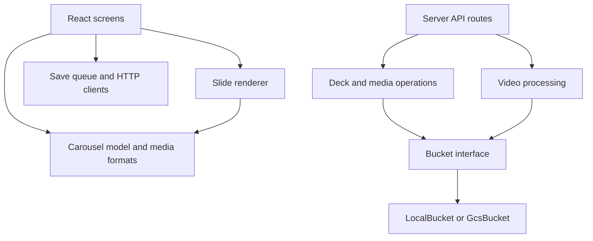

# Vertica architecture

## Executive summary

Vertica is a React application for creating carousel decks and exporting PDF, JPEG and single-slide MP4 files. One Node service hosts the built application and its HTTP API. An object bucket holds the durable source of truth: deck JSON, images and videos. There is no database.

The browser owns editing state and rendering. The server owns authenticated access, persistence and video processing. Every existing-deck save must carry the object generation last read by the client. Conditional writes prevent a stale editor from overwriting a newer save.

### System architecture

### Dependency hierarchy

Browser and server communicate through HTTP. Storage operations depend on the bucket interface, which has local-filesystem and Google Cloud Storage implementations. The server also imports shared validation and media-format helpers from `app/` (`carousel-validation.ts`, `image-formats.ts`, `video-formats.ts`); the Docker image copies every plain `.ts` module under `app/` for that reason. Browser API clients import server record types as type-only dependencies.

## Document and rendering model

`app/carousel.ts` defines the deck model, import parser, layout normalization and SVG sanitization. A deck contains branding, a theme and slides using four layouts: cover, content, note and closing. Slides can reference images, videos or inline SVG diagrams.

`Slide` is the shared renderer for the editor, gallery cards, reader preview and export stage. Layout and typography scale with the slide container. SVG diagrams are sanitized when imported and again when rendered. The API performs its own structural save validation; it does not invoke the full browser import parser.

## Persistence and saving

Decks are stored as `carousels/<id>.json`. Object metadata holds gallery summaries, a compact cover description, timestamps and media references. Listing the gallery reads object metadata rather than downloading every deck. The list includes all deck summaries, sorted by update time. The gallery renders 24 cards at a time with a Load more action; search and sorting cover the entire library.

Saving follows this order:

1. The editor queues the latest document. `SaveQueue` coalesces pending changes and serializes writes.
2. The API client uploads new image bytes and replaces their inline references with `img:` keys.
3. The client sends deck JSON and its last known object generation to the API.
4. The API checks authentication and validates the payload, then derives summary metadata.
5. The store writes with an expected-generation precondition. New decks require the object not to exist.
6. The returned generation becomes the version for the next save. A stale write returns HTTP 409 and puts the editor into a reload-required state. Failed queue writes remain dirty.

Images live at `media/<hash>` under content-derived keys. IndexedDB caches image bytes; durable persistence remains in the bucket. Loading resolves keys into renderable image data. Unresolved keys remain in the document so a later save does not erase missing references.

Removing media checks deck metadata and refuses an asset already in use. Otherwise it hides the library entry while retaining bytes, protecting references saved concurrently after that check. Images use a library metadata flag; videos use a small `.removed` marker. Image reuploads restore library visibility; video reuploads create a new asset. Retained media has no automatic purge and still incurs storage costs.

## Export and video processing

PDF and JPEG exports rasterize the mounted export stage in the browser using `html-to-image`. Export waits for fonts and image decoding. Slides use a 1080 × 1350 logical canvas and are rasterized at twice that resolution. `jsPDF` assembles PDF pages; the local ZIP helper packages numbered JPEG files.

For video backgrounds, still exports request the selected clip's first frame from the server. MP4 export captures the slide artwork as a transparent PNG overlay and sends it with the clip settings to the server. FFmpeg composites the overlay over the source clip and returns a silent 1080 × 1350 H.264 file for one slide.

Video uploads use bucket-backed chunks and manifests, allowing requests to reach different service instances. Processing assembles the chunks on temporary disk, probes the source and creates a playback MP4 and poster. Compatible sources can be repackaged without re-encoding; other sources receive a smaller playback encode. The untouched original is retained for exports. Older assets without retained originals export from their playback copy.

The server admits one video-processing job per instance and returns a retryable 503 when busy. Upload processing removes chunks afterward and rolls back objects owned by a failed upload. Expired upload sessions are cleaned up on a later upload. Temporary working directories are removed after processing.

## Authentication and deployment

The application uses a shared password, not individual accounts. Session endpoints exchange the configured password for an HMAC-signed, HttpOnly cookie. Authentication middleware protects the remaining API routes, including media and video access. Static application files are served separately from that API gate.

Production startup requires `BUCKET` and `APP_SECRET`. With a bucket configured, storage uses Google Cloud Storage. Local development defaults to `.data/`, configurable through `DATA_DIR`, and permits access without a configured secret.

In development, Vite serves the frontend and proxies `/api` to the Node service on port 8787. In production, a Docker image contains the Vite build, Node API and FFmpeg. The deployment script targets Cloud Run with 2 GiB memory, two CPUs, four concurrent requests, a 300-second request timeout and at most three instances. These are repository configuration values, not verified live infrastructure settings.

## Source map

| Concept | Authoritative files |
| --- | --- |
| Application navigation and editor state | [app.tsx](app/app.tsx), [editor.tsx](app/editor.tsx), [inspector.tsx](app/inspector.tsx), [use-history.ts](app/use-history.ts) |
| Document model and rendering | [carousel.ts](app/carousel.ts), [slide.tsx](app/slide.tsx), [composer.tsx](app/composer.tsx) |
| Autosave and HTTP persistence | [save-queue.ts](app/save-queue.ts), [api-client.ts](app/api-client.ts) |
| Browser image cache | [image-store.ts](app/image-store.ts) |
| Export assembly | [export.ts](app/export.ts), [zip.ts](app/zip.ts) |
| HTTP host and authentication | [index.ts](server/index.ts), [api.ts](server/api.ts), [auth.ts](server/auth.ts) |
| Durable storage | [store.ts](server/store.ts), [bucket.ts](server/bucket.ts) |
| Video upload and processing | [video-client.ts](app/video-client.ts), [video.ts](server/video.ts) |
| Build and deployment | [vite.config.ts](vite.config.ts), [Dockerfile](Dockerfile), [deploy.sh](deploy.sh) |

## Verification

This document describes the working-tree implementation inspected on 2026-09-09. Runtime topology, authentication boundaries, save ordering, storage preconditions and export paths were checked against the source files above.

Existing test suites cover API authentication and stale writes, save-queue ordering and retries, bucket behavior, rendering, image persistence and video processing. `npm test` runs type checking, the frontend build and Node test suites. FFmpeg integration checks require FFmpeg and ffprobe. Tests were not run for this documentation-only change. Live Cloud Run resources, bucket permissions and deployed revision settings were not inspected.
